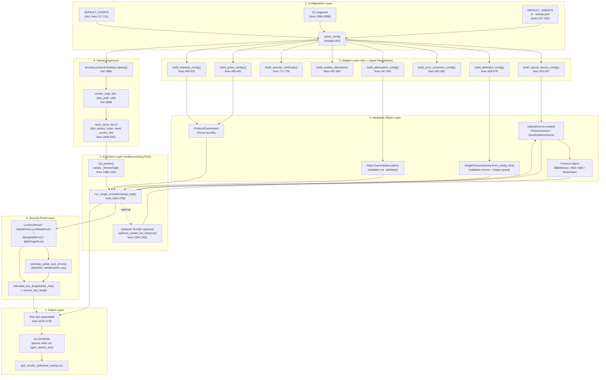
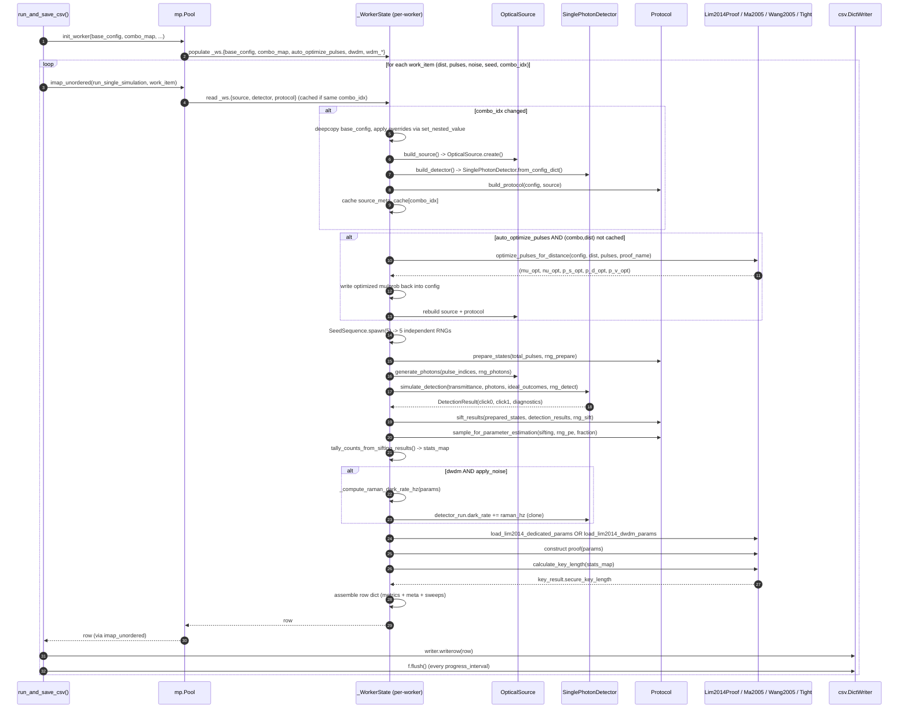

# QKD Simulation Specification — `main_optimized.py`

**Document type:** Technical Reference Specification
**Source artifact:** `main_optimized.py` (3,210 lines, ~104 KB)
**Module role:** Entrypoint / orchestrator for the `qkd.*` Quantum Key Distribution simulation stack
**Author of spec:** Principal Software & Systems Engineer (QKD Simulation Architectures)
**Status:** Compile-safe Markdown — all variable names, defaults, and ranges extracted directly from source.

---

## 0. Document Scope & File Provenance

This specification reverse-engineers `main_optimized.py` into a complete, machine-checkable parameter and behaviour contract. It is intended for three audiences:

1. **Simulation operators** — who need to know which CLI flags / `DEFAULT_CONFIG` keys move which physical knob, and which knobs are sweep-safe.
2. **Proof / security engineers** — who need to know which epsilon budget, security proof, and confidence-bound method are active for a given run, and what constraints they must satisfy.
3. **Performance / HPC engineers** — who need to know the worker-process model, RNG-derivation scheme, and which stages are vectorisable vs. single-threaded.

The file under analysis is a **monolithic orchestrator** (TODO F-24 in source: scheduled to be split into `config.py`, `simulation.py`, `cli.py`). It performs, in order:

- Configuration assembly from `DEFAULT_CONFIG` + CLI overrides + sweep overrides.
- Adapter-layer construction of typed dataclasses (`OpticalSourceConfig`, `DetectionConfig`, `ErrorCorrectionConfig`, `ProtocolParameters`, `SecurityCertificate`, `EpsilonAllocation`).
- Hardware object construction (`OpticalSource`, `SinglePhotonDetector`, `FiberChannel`, `Protocol`).
- Per-(combo, distance, pulse_count, noise-flag) Monte-Carlo simulation in `multiprocessing.Pool`.
- Security-proof execution (`Lim2014Proof`, `Ma2005VacuumWeakProof`, `Wang2005Proof`, `BB84TightProof`) → secure key length.
- CSV emission to `qkd_results_optimized_sweep.csv` with atomic-write semantics.

All default values in the tables below are quoted **verbatim from `DEFAULT_CONFIG` (lines 117–211)** unless otherwise noted. CLI defaults (from `argparse`, lines 2984–3098) are quoted separately when they diverge from `DEFAULT_CONFIG`.

---

## 1. Architectural Flow

### 1.1 High-Level Pipeline (Mermaid flowchart)



### 1.2 Sequence Diagram — Single Simulation Point (Mermaid)



### 1.3 Stage-by-Stage Description

| Stage | Source lines | Purpose | Concurrency model |
|---|---|---|---|
| 1. Configuration | 117–211, 2984–3181 | Merge `DEFAULT_CONFIG` with CLI argparse namespace and (optionally) `--sweep-json`. Produce `active_config` dict. | Single-threaded, main process only. |
| 2. Adapter layer | 297–791 | Convert nested dict into typed dataclasses (`OpticalSourceConfig`, `DetectionConfig`, `ErrorCorrectionConfig`, `AttenuationConfig`, `IntensityConfig`, `EpsilonAllocation`, `SecurityCertificate`, `ProtocolParameters`). Enum strings are normalised via `parse_enum()`; detector enums via `normalize_detector_config()`. | Single-threaded. Per-combo (inside worker). |
| 3. Hardware construction | 765–810, 962–1041, 1112–1132, 1135–1171 | Build `OpticalSource`, `SinglePhotonDetector`, `FiberChannel`, `Protocol` from the typed config objects. Detector construction runs `_validate_params()` atomically (no `setattr` overrides). | Single-threaded per worker; one rebuild per `combo_idx`. |
| 4. Sweep expansion | 2884–2911 | `itertools.product(*sweeps.values())` → `combo_map`. For each combo, for each `apply_noise` in `[False, True]`, for each `total_pulses` in `10**range(min_log, max_log+1)`, for each `dist` in `np.linspace(start, stop, points)` → `work_items` list. | Single-threaded expansion; the resulting list is dispatched to the pool. |
| 5. Execution | 1954–2790 | `run_single_simulation(args_tuple)` is the worker. Caches source/detector/protocol on `_WorkerState` across rows sharing the same `combo_idx`. Per-(combo,dist) cache for the SLSQP optimizer. RNGs derived via `np.random.SeedSequence(worker_seed).spawn(5)`. | `multiprocessing.Pool.imap_unordered` with `chunksize = max(1, min(100, len(work_items) // (num_workers * 8)))`. Single-worker fallback preserves order. |
| 6. Security proof | 2376–2604 | Dispatches on `proof_name` (`LIM_2014`, `MA_2005`, `WANG_2005`, `TIGHT`). MA2005 / WANG2005 receive a remapped `stats_map` with keys `signal` / `decoy` / `vacuum`; Lim2014 / Tight receive the raw integer-keyed `stats_map`. Epsilon auto-rescale is applied for MA2005/WANG2005 when the budget sum exceeds `eps_sec`. | Single-threaded per worker. |
| 7. Output | 2920–2977 | CSV row dict assembled, then `csv.DictWriter.writerow()`. File opened via `open_atomic_text()` (atomic rename on close). Header `fieldnames` is the union of fixed columns, `DETECTOR_METADATA_KEYS`, `source_meta_keys`, `DETECTOR_OVERRIDE_KEYS`, `PARAMS_METADATA_KEYS`, and per-sweep keys prefixed `sweep_<dotted_path>`. | Main process consumes `imap_unordered` iterator; writes are serialised to the CSV file. |

---

## 2. Comprehensive Parameter Inventory

The parameter tables below are organised into three categories. Each row carries:

- **Parameter Name** — exact dotted Python path inside `DEFAULT_CONFIG` (or CLI flag for CLI-only parameters).
- **Physical Meaning / Description** — one-line semantics.
- **Data Type & Units** — Python type and physical units.
- **Default Value** — verbatim from `DEFAULT_CONFIG` (lines 117–211) unless marked *(CLI default)*.
- **Valid / Typical Range** — `(min, max, recommended step)`.
- **Sweep Suitability** — `single-point` (not intended for sweeps), `1D-candidate` (good for one-axis sweeps), `2D-candidate` (good for two-axis contour sweeps against distance), or `categorical` (enumerated values).

### 2.1 Optical / Physical Link Parameters

This category covers all parameters describing the **physical channel** and **detection apparatus** between Alice and Bob.

#### 2.1.1 Fiber Channel (`config["channel"]`)

| Parameter Name | Physical Meaning | Type & Units | Default | Valid / Typical Range | Sweep Suitability |
|---|---|---|---|---|---|
| `channel.fiber_loss_db_km` | Per-kilometre attenuation of optical fibre at the carrier wavelength (1550 nm by convention). Used to derive `AttenuationConfig` and `FiberChannel.total_loss_db = fiber_loss * L`. | `float`, dB/km | `0.2` (CLI: `--fiber-loss`, default `0.2`) | `(0.0, MAX_FIBER_LOSS_DB_KM]`. Recommended: `0.16`–`0.25` for SMF-28 at 1550 nm; step `0.01`. Note: `0.0` is permitted and yields a lossless channel (see `is_lossless` guard at line 1124). | 1D-candidate. Prime axis for sensitivity studies alongside distance. |
| `channel.dispersion_parameter_ps_nm_km` | Chromatic dispersion coefficient of the fibre. Consumed by the detector kernel (passed as `dispersion_parameter_ps_nm_km` kwarg to `simulate_detection`, line 2318) but not by the analytical channel model. | `float`, ps/(nm·km) | `0.0` (commented sweep value: `[0.0, 17.0]`) | `0.0`–`17.0` (standard SMF at 1550 nm ≈ 17 ps/nm/km); step `1.0`. | 1D-candidate for dispersion-tolerance studies. |

#### 2.1.2 Detector (`config["detector"]`)

| Parameter Name | Physical Meaning | Type & Units | Default | Valid / Typical Range | Sweep Suitability |
|---|---|---|---|---|---|
| `detector.det_eff_d0` | Quantum efficiency of detector D0 (Bob's "0"-bit detector in BB84). | `float`, dimensionless [0,1] | `0.15` (InGaAs SPAD; CLI: `--det-eff-d0`) | `0.05`–`0.95`; SNSPD preset pushes to `0.75`. Recommended step: `0.05`. | 1D-candidate; 2D-candidate against `distance_km`. |
| `detector.det_eff_d1` | Quantum efficiency of detector D1 (Bob's "1"-bit detector). | `float`, dimensionless [0,1] | `0.15` (CLI: `--det-eff-d1`) | `0.05`–`0.95`; step `0.05`. | 1D-candidate; pair with `det_eff_d0` for asymmetry studies. |
| `detector.dark_rate` | Dark-count rate of D0. Post-detection-efficiency (i.e. already multiplied by `det_eff_d0` internally). | `float`, Hz | `600.0` (SPAD; CLI: `--dark-rate`). SNSPD preset: `1.0`; PNRD preset: `1000.0`. | `1.0` (SNSPD) – `10^5` (warm InGaAs). Step: log-decade. | 1D-candidate (log axis). |
| `detector.dark_rate_d1` | Dark-count rate of D1. `None` means "same as `dark_rate`" inside the detector constructor. | `float` or `None`, Hz | `1200.0` | `1.0` – `10^5`. Step: log-decade. | 1D-candidate; typically left at 2× `dark_rate`. |
| `detector.qber_intrinsic` | Baseline QBER contribution from detector misalignment + optical imperfections, applied to non-vacuum clicks. | `float`, dimensionless [0,1] | `0.005` (CLI: `--qber-intrinsic`) | `0.001`–`0.05`; step `0.005`. | 1D-candidate; 2D-candidate against distance for QBER budget studies. |
| `detector.misalignment` | Static optical misalignment angle between Alice and Bob's bases, expressed as a QBER fraction. | `float`, dimensionless [0,1] | `0.0` (CLI: `--misalignment`) | `0.0`–`0.05`; step `0.002`. | 1D-candidate. |
| `detector.dead_time_ns` | Recovery time after a click during which the detector cannot fire. Used by Rogers et al. (2007) analytic SBR cross-check (Eq. 15). | `float`, ns | `10.0` (CLI: `--dead-time-ns` overrides). SNSPD preset: `10.0`; PNRD preset: `50.0`. | `0.0`–`100.0`; step `1.0`. Must be > 0 for `rogers_2007` sifting policy. | 1D-candidate; 2D-candidate against `pulse_period_ns`. |
| `detector.jitter_fwhm_ns` | Full-width half-maximum timing jitter of detection events. | `float`, ns | `0.0` (commented sweep: `0.050`). SNSPD preset: `0.020`; SPAD preset: `0.300`. | `0.0`–`1.0`; step `0.010`. | 1D-candidate (log axis). |
| `detector.afterpulse_prob` | Per-click probability of a spurious afterpulse firing in a subsequent gate. | `float`, dimensionless [0,1] | `0.001` (SPAD preset: `0.008`). SNSPD/PNRD: `0.0`. | `0.0`–`0.05`; step `0.001`. | 1D-candidate. |
| `detector.afterpulse_lifetime_ns` | Exponential decay lifetime of the afterpulse distribution (when `afterpulse_model = EXPONENTIAL`). | `float`, ns | `10.0` (commented sweep: `[10.0, 100.0, 500.0]`) | `1.0`–`1000.0`; step log-decade. | 1D-candidate (log axis). |
| `detector.double_click_policy` | Detector-level resolution for simultaneous D0&D1 clicks. | `Enum[DoubleClickPolicy]` or sentinel string `ROGERS_2007_POLICY` | `"RANDOM"` (CLI: `--detector-double-click-policy` with `choices=[RANDOM, DISCARD, rogers_2007]`). | 3 categorical values. `rogers_2007` requires `dead_time_ns > 0`. | categorical. |
| `detector.detector_type` | Hardware family. Triggers `DETECTOR_PRESETS` cascade (lines 263–294). | `Enum[DetectorType]` (`SPD`, `SNSPD`, `PNRD`) | `"SPD"` (CLI: `--detector-type`) | 3 categorical values. Incompatible with `strict_mode=True` + dead_time/afterpulse/jitter > 0 (warning at lines 2035–2044, hard failure inside `_validate_params()`). | categorical; primary axis for detector technology studies. |
| `detector.dead_time_model` | Statistical model of how dead time blocks subsequent clicks. `PARALYZABLE` is deprecated (per Rogers et al. 2007; F-28). | `Enum[DeadTimeModel]` (`NON_PARALYZABLE`, `PARALYZABLE`) | `"NON_PARALYZABLE"` | 2 categorical values; `PARALYZABLE` emits deprecation warning. | categorical (single-point — `PARALYZABLE` not swept per F-28). |
| `detector.afterpulse_model` | Statistical distribution of afterpulse delays. | `Enum[AfterpulseModel]` (`EXPONENTIAL`, `GEOMETRIC`) | `"EXPONENTIAL"` | 2 categorical values. | categorical. |
| `detector.temperature_k` | Detector operating temperature. Used by the detector's overbias/temperature-coefficient kernel. | `float`, K | `293.0` (commented sweep: `[77.0, 293.0]`) | `77.0` (LN2) – `293.0` (room); step: categorical. | categorical (2-point). |
| `detector.bias_voltage` | Applied bias voltage. Must exceed `breakdown_voltage` for SPADs (Geiger-mode guard inside `_validate_params()`). | `float`, V | `50.0` | `> breakdown_voltage` for SPD; arbitrary for SNSPD/PNRD. | 1D-candidate (paired with `breakdown_voltage`). |
| `detector.breakdown_voltage` | Breakdown threshold of the SPAD junction. | `float`, V | `45.0` | Depends on device; typical `20`–`60`. | 1D-candidate (paired with `bias_voltage`). |
| `detector.ref_temperature_k` | Reference temperature for the temperature-coefficient model. | `float`, K | `293.0` | matches `temperature_k` typically. | single-point. |
| `detector.ref_bias_voltage` | Reference bias voltage for the overbias model. | `float`, V | `50.0` | matches `bias_voltage` typically. | single-point. |
| `detector.strict_mode` | When `True`, raises `ParameterValidationError` for incompatible PNRD + dead_time/afterpulse/jitter combos. | `bool` | `False` (commented sweep: `[False, True]`) | boolean. | categorical. |

#### 2.1.3 Detector Presets (`DETECTOR_PRESETS`, lines 263–294)

Presets are applied automatically when `detector_type` is changed via CLI or sweep. The preset cascade is currently commented out (lines 1987–1999) but the preset tables remain authoritative for the values each detector family expects.

| Preset | `det_eff_d0/d1` | `dark_rate` (Hz) | `dark_rate_d1` (Hz) | `afterpulse_prob` | `afterpulse_lifetime_ns` | `dead_time_ns` | `jitter_fwhm_ns` | Source citation |
|---|---|---|---|---|---|---|---|---|
| `SPD` (InGaAs SPAD) | 0.15 | 600 | 1200 | 0.008 | 20.0 | 20.0 | 0.300 | Hadke et al., NJP 2016; Korzh et al., PRL 2015 |
| `SNSPD` | 0.75 | 1.0 | 1.0 | 0.0 | 0.0 | 10.0 | 0.020 | You et al., Nature 2023; Marsili et al., Nat. Photon. 2013 |
| `PNRD` | 0.45 | 1000 | 1000 | 0.0 | 0.0 | 50.0 | 0.100 | Chen et al., PRL 2022; Humphreys et al., Nature 2020 |

### 2.2 Protocol Parameters

This category covers all parameters describing the **state-preparation protocol**, the **decoy-state intensities**, the **basis-choice probabilities**, the **error-correction efficiency**, and the **security-proof epsilon budget**.

#### 2.2.1 Protocol Family & Runtime (`config["protocol_params"]`, `config["protocol_runtime"]`)

| Parameter Name | Physical Meaning | Type & Units | Default | Valid / Typical Range | Sweep Suitability |
|---|---|---|---|---|---|
| `protocol_params.protocol` | High-level protocol family. | `Enum[ProtocolType]` (string key in `DEFAULT_CONFIG`; parsed via `parse_enum` at line 709). | `"BB84_DECOY"` | Categorical: `BB84_DECOY`, `B92`, `MDI_QKD`, `REDUNDANT`. | categorical. |
| `protocol_params.detector_type` | Detector type mirrored into protocol params for source-routing decisions. | `Enum[DetectorType]` | `"SPD"` (CLI: `--detector-type` propagates here, line 3148) | 3 categorical values. | categorical (kept in sync with `detector.detector_type`). |
| `protocol_params.error_correction_efficiency` | Cascade/LDPC reconciliation inefficiency factor `f_EC`. Consumed by `ErrorCorrectionConfig` (line 682) and forwarded to `Lim2014Proof` as `f_error_correction`. | `float`, dimensionless ≥ 1.0 | `1.16` (CLI: `--f-error-correction` overrides; factory default `1.16`). | `1.0` (ideal) – `1.25`; step `0.01`. | 1D-candidate. |
| `protocol_runtime.protocol_class` | Python class name of the protocol implementation. Selects the constructor dispatch at `build_protocol()` (lines 1135–1171). | `str` (one of: `BB84DecoyProtocol`, `B92Protocol`, `MDIQKDProtocol`, `RedundantTransmissionProtocol`). | `"BB84DecoyProtocol"` (CLI: `--protocol-class`) | 4 categorical values. | categorical; primary axis for protocol comparison. |
| `protocol_runtime.alice_z_basis_prob` | Probability Alice chooses the Z (rectilinear) basis. Used only by `BB84DecoyProtocol`. | `float`, [0,1] | `0.5` (CLI: `--alice-z-basis-prob`) | `0.25`–`0.75`; step `0.05`. Optimal: `0.5` for balanced sifting. | 1D-candidate. |
| `protocol_runtime.bob_z_basis_prob` | Probability Bob chooses the Z basis. Used by `BB84DecoyProtocol` and `B92Protocol`. | `float`, [0,1] | `0.5` (CLI: `--bob-z-basis-prob`) | `0.25`–`0.75`; step `0.05`. | 1D-candidate. |
| `protocol_runtime.z_basis_prob` | Symmetric Z-basis probability. Used by `MDIQKDProtocol`. | `float`, [0,1] | `0.5` (CLI: `--z-basis-prob`) | `0.25`–`0.75`; step `0.05`. | 1D-candidate. |
| `protocol_runtime.double_click_policy` | **Protocol-level** double-click policy (distinct from the detector-level policy). | `Enum[DoubleClickPolicy]` or `ROGERS_2007_POLICY` sentinel | `"DISCARD"` (CLI: `--protocol-double-click-policy`) | 3 categorical values. | categorical. |
| `protocol_runtime.redundancy_M` | Redundancy factor for `RedundantTransmissionProtocol`. | `int`, ≥ 1 | `3` (commented sweep: `[2, 3]`) | `2`–`5`; step `1`. | 1D-candidate; only relevant for `RedundantTransmissionProtocol`. |
| `protocol_runtime.use_entangling_decoder` | Toggle for the entangling-decoder post-processing path in `RedundantTransmissionProtocol`. | `bool` | `False` (commented sweep: `[False, True]`) | boolean. | categorical. |
| `protocol_runtime.use_entangling_encoder` | Toggle for the entangling-encoder path. | `bool` | `False` | boolean. | categorical. |
| `protocol_runtime.codeword_mapping` | Optional codeword mapping table for redundant transmission. | `Any` (`None` or dict-like) | `None` | n/a. | single-point. |
| `protocol_runtime.damping_parameter` | Damping parameter for the entangling decoder. | `float` or `None` | `None` | `0.0`–`1.0`; step `0.1`. | 1D-candidate when entangling decoder enabled. |
| `protocol_runtime.rotation_angle` | Rotation angle for the entangling decoder. | `float` or `None`, radians | `None` | `[0, 2π)`; step `π/16`. | 1D-candidate when entangling decoder enabled. |
| `protocol_runtime.parameter_estimation_fraction` | Fraction of sifted bits revealed for parameter estimation. | `float`, [0,1) | `0.1` (CLI: `--parameter-estimation-fraction`) | `0.05`–`0.3`; step `0.05`. | 1D-candidate; affects finite-size penalty. |
| `protocol_runtime.num_worker_rngs` | Number of independent RNG streams derived via `SeedSequence.spawn`. Fixed at `5` internally (line 2122). | `int` | `2` (legacy default in config) | Hard-coded to `5` inside `run_single_simulation`. | single-point. |

#### 2.2.2 Decoy-State Intensities (`config["source"]["pulses"]`)

The default config uses the classic **3-pulse decoy-state** scheme (signal + decoy + vacuum). The intensity config is built by `build_intensity_config()` (lines 499–523), which **hardcodes the three role names** `"signal"`, `"decoy"`, `"vacuum"`. For >3 decoys, `build_intensity_config_from_source(source)` (lines 526–545) is the preferred path; it uses role-based name lookup.

| Parameter Name | Physical Meaning | Type & Units | Default | Valid / Typical Range | Sweep Suitability |
|---|---|---|---|---|---|
| `source.pulses.signal.mu` | Mean photon number μ of the **signal** pulse. Drives `Q_Z` and `Q_X` gain and the single-photon yield `y_1` lower bound. | `float`, photons/pulse | `0.5` (commented sweep: `[0.3, 0.5, 0.8]`) | `0.1`–`1.0`; step `0.1`. Optimal ~`0.5` for short-to-medium distances. | 1D-candidate; 2D-candidate against `source.pulses.decoy.mu`. |
| `source.pulses.signal.prob` | Probability of emitting the signal pulse. | `float`, [0,1] | `0.6` | `0.4`–`0.8`; step `0.1`. | 1D-candidate; auto-balanced by `_balance_decoy_probabilities()` (lines 1887–1931). |
| `source.pulses.decoy.mu` | Mean photon number ν of the **decoy** pulse. | `float`, photons/pulse | `0.1` (commented sweep: `[0.05, 0.1, 0.2]`) | `0.01`–`0.3`; step `0.05`. Should be `< signal.mu` and `> vacuum.mu`. | 1D-candidate; 2D-candidate against `signal.mu`. |
| `source.pulses.decoy.prob` | Probability of emitting the decoy pulse. | `float`, [0,1] | `0.2` | `0.1`–`0.4`; step `0.05`. | 1D-candidate; auto-balanced. |
| `source.pulses.vacuum.mu` | Mean photon number of the **vacuum** pulse. Should be exactly `0.0` (true vacuum). | `float`, photons/pulse | `0.0` | Fixed at `0.0`. | single-point. |
| `source.pulses.vacuum.prob` | Probability of emitting the vacuum pulse. | `float`, [0,1] | `0.2` | `0.1`–`0.3`; step `0.05`. | 1D-candidate; auto-balanced. |

**Constraint (validated implicitly by `_balance_decoy_probabilities()`):**
`P_signal + P_decoy + P_vacuum == 1.0`. If the user sweeps only one of `P_signal` or `P_decoy`, the function auto-computes the other to maintain the sum (line 1915 / 1923). Negative results raise `ConfigurationError`.

#### 2.2.3 Source (`config["source"]` — non-pulse fields)

| Parameter Name | Physical Meaning | Type & Units | Default | Valid / Typical Range | Sweep Suitability |
|---|---|---|---|---|---|
| `source.source_class` | High-level source family. | `str` (`"optical"`) | `"optical"` (CLI: `--source-class`) | Categorical: `optical`. | single-point. |
| `source.pulse_period_ns` | Inter-pulse period. `source_rate = 1e9 / pulse_period_ns` (derived property on `OpticalSourceConfig`). | `float`, ns | `10.0` (corresponds to 100 MHz) | `0.1`–`1000.0`; step log-decade. | 1D-candidate; cross-check against Rogers et al. (2007) Eq. 15. |
| `source.source_rate` | Alternative to `pulse_period_ns`. Mutually exclusive (one must be set; see guard at line 577). | `float`, Hz | Derived from `pulse_period_ns`. | `1e6`–`1e12`; step log-decade. | 1D-candidate. |
| `source.intensity_jitter` | Relative jitter on the mean photon number per pulse. | `float`, dimensionless | `0.0` | `0.0`–`0.1`; step `0.01`. | 1D-candidate. |
| `source.modulation_index` | WDM intensity modulation index (needed for Rogers integration). | `float`, dimensionless | `0.0` | `0.0`–`1.0`; step `0.1`. | 1D-candidate. |
| `source.statistics_type` | Photon-number distribution family. `POISSON` = coherent laser; `THERMAL` = thermal/chaotic source. | `Enum[SourceStatisticsType]` | `"POISSON"` (CLI: `--statistics-type`) | 2 categorical values. Note: `THERMAL + ADVERSARIAL_BLOCK` triggers a warning at line 2004. | categorical. |
| `source.error_model` | Source error model for μ-fluctuations. | `Enum[SourceErrorModel]` (`RANDOM_GAUSSIAN`, `ADVERSARIAL_BLOCK`) | `"RANDOM_GAUSSIAN"` (CLI: `--error-model`) | 2 categorical values. | categorical. |
| `source.expected_decoder` | Decoder architecture expected by the source. | `Enum[DecoderArchitecture]` (`LOCAL`, …) | `"LOCAL"` | Categorical; embedded in `lp_solver_diagnostics` only. | single-point. |
| `source.assumed_double_click` | Assumed double-click semantics for the source's `lp_solver_diagnostics`. | `str` (enum-like) | `"RANDOM"` | n/a. | single-point. |
| `source.intended_proof` | Security proof to invoke at the key-rate calculation stage. | `Enum[SecurityProof]` (`LIM_2014`, `MA_2005`, `WANG_2005`, `TIGHT`) | `"LIM_2014"` (CLI: `--intended-proof`) | 4 categorical values. MA2005 / WANG2005 trigger epsilon auto-rescale. | categorical; primary axis for security-proof comparison. |
| `source.confidence_method` | Confidence-bound method for parameter-estimation intervals. | `Enum[ConfidenceBoundMethod]` (`GAUSSIAN`, `HOEFFDING`, `CLOPPER_PEARSON`) | `"GAUSSIAN"` (CLI: `--confidence-method`) | 3 categorical values. | categorical. |
| `source.source_fidelity` | Source fidelity against the ideal single-photon reference state. | `float`, [0,1] | `0.995` | `0.9`–`1.0`; step `0.005`. | 1D-candidate. |
| `source.adversarial_block_size` | Block size for adversarial-fluctuation modelling. | `int`, pulses | `1000` | `100`–`10^6`; step log-decade. | 1D-candidate. |
| `source.extinction_ratio` | Source MZM extinction ratio (linear). | `float`, dB | `80.0` | `30`–`120`; step log-decade. | 1D-candidate. |
| `source.temperature_k` | Source operating temperature. | `float`, K | `298.15` | `77.0`–`350.0`; step `10.0`. | 1D-candidate. |
| `source.bandwidth_hz` | Driver electronics bandwidth. | `float`, Hz | `1e9` | `1e6`–`1e10`; step log-decade. | 1D-candidate. |
| `source.driver_load_resistance_ohm` | Driver load resistance. | `float`, Ω | `50.0` | `50.0`–`1000.0`; step `10.0`. | single-point. |
| `source.dc_photocurrent_a` | DC monitor photocurrent. | `float`, A | `1e-6` | `1e-9`–`1e-3`; step log-decade. | 1D-candidate. |
| `source.v_pi` | MZM half-wave voltage. | `float`, V | `3.5` | `1.0`–`10.0`; step `0.5`. | single-point. |
| `source.phi_bias` | MZM bias phase. | `float`, radians | `math.pi / 2.0` | `[0, 2π)`; step `π/16`. | single-point. |
| `source.max_intensity_mu` | Maximum allowed mean photon number (cap). | `float`, photons/pulse | `1.0` | `0.5`–`10.0`; step `0.5`. | single-point. |
| `source.preferred_lp_solver` | Linear-programming solver preference for the security proof. | `str` (`"highs"`, …) | `"highs"` | Categorical: `highs`, `scipy`, etc. | single-point. |
| `source.N_channels` | Number of WDM channels (quantum channel not counted). | `int`, ≥ 1 | `1` (commented sweep: `[2, 4]`) | `1`–`32`; step `2`. | 1D-candidate; drives Raman-noise scaling. |
| `source.is_bidirectional` | Whether classical + quantum co-propagate on the same fibre. | `bool` | `False` (commented sweep: `[False, True]`) | boolean. | categorical. |
| `source.use_small_angle_approximation` | Toggle for small-angle approximation in MZM modulation. | `bool` | `True` | boolean. | categorical. |
| `source.use_linear_modulation_approximation` | Toggle for linear-modulation approximation. | `bool` | `False` (CLI: `--use-linear-modulation`) | boolean. | categorical. |
| `source.ideal_emission_probability` | Probability of ideal single-photon emission (used by source-fidelity model). | `float`, [0,1] | `1.0` (CLI: `--ideal-emission-probability`) | `0.5`–`1.0`; step `0.05`. | 1D-candidate. |
| `source.security_metadata` | Optional `SourceSecurityMetadata` dict (loaded via `from_dict`). | `dict` or `None` | `None` | n/a. | single-point. |
| `source.density_matrices` | Optional density matrices per pulse type. Validated for Hermiticity, trace, and PSD inside `OpticalSource.create()`. | `dict` or `None` | `{}` | n/a. | single-point (advanced). |
| `source.mzm.extinction_ratio_db` | MZM extinction ratio (dB). Falls back to `source.extinction_ratio` if absent. | `float`, dB | `80.0` | `30`–`120`; step log-decade. | 1D-candidate. |
| `source.mzm.v_pi` | MZM half-wave voltage. Falls back to `source.v_pi`. | `float`, V | `3.5` | `1.0`–`10.0`; step `0.5`. | single-point. |
| `source.mzm.bias_voltage` | MZM bias voltage. | `float`, V | `1.75` | `0.0`–`5.0`; step `0.25`. | 1D-candidate. |
| `source.mzm.rf_amplitude_v` | MZM RF drive amplitude. | `float`, V | `3.5` | `0.0`–`10.0`; step `0.5`. | 1D-candidate. |
| `source.electrical_noise.voltage_std_v` | Standard deviation of the electrical noise voltage. | `float`, V | `0.05` | `0.001`–`1.0`; step log-decade. | 1D-candidate. |
| `source.electrical_noise.bandwidth_hz` | Noise bandwidth. Falls back to `source.bandwidth_hz`. | `float`, Hz | `1e9` | `1e6`–`1e10`; step log-decade. | 1D-candidate. |

#### 2.2.4 Epsilon Allocation (`config["protocol"]["epsilons"]`)

Built by `build_epsilon_allocation()` (lines 452–483). Validated by F-17: all epsilons must be strictly positive, and their sum must be `< 1.0`.

| Parameter Name | Physical Meaning | Type & Units | Default | Valid / Typical Range | Sweep Suitability |
|---|---|---|---|---|---|
| `protocol.epsilons.eps_sec` | Overall compositional security parameter. | `float`, dimensionless | `1e-9` (CLI: `--eps-sec` overrides factory default `1e-7`) | `1e-12`–`1e-6`; step log-decade. | 1D-candidate. |
| `protocol.epsilons.eps_cor` | Epsilon for error correction. | `float` | `1e-10` (CLI: `--eps-cor`) | `1e-12`–`1e-7`; step log-decade. | 1D-candidate. |
| `protocol.epsilons.eps_pe` | Epsilon for parameter estimation. | `float` | `1e-10` (CLI: `--eps-pe`) | `1e-12`–`1e-7`; step log-decade. | 1D-candidate. |
| `protocol.epsilons.eps_smooth` | Epsilon for smooth min-entropy. | `float` | `1e-10` (CLI: `--eps-smooth`) | `1e-12`–`1e-7`; step log-decade. | 1D-candidate. |
| `protocol.epsilons.eps_pa` | Epsilon for privacy amplification. | `float` | `1e-10` | `1e-12`–`1e-7`; step log-decade. | 1D-candidate. |
| `protocol.epsilons.eps_phase_est` | Epsilon for phase-error estimation. | `float` | `1e-10` | `1e-12`–`1e-7`; step log-decade. | 1D-candidate. |

**Constraint (validated in `build_epsilon_allocation()`, line 468):**
`eps_sec + eps_cor + eps_pe + eps_smooth + eps_pa + eps_phase_est < 1.0`. Violation raises `ParameterValidationError`.

**Additional runtime constraint (MA2005 / WANG2005 auto-rescale, lines 2484–2548):**
`eps_pe + eps_cor + eps_smooth + eps_pa ≤ eps_sec`. If violated, all four are rescaled to `eps_sec / 10`.

#### 2.2.5 Security Certificate (`config["protocol"]`, lines 717–735)

| Parameter Name | Physical Meaning | Type & Units | Default | Valid / Typical Range | Sweep Suitability |
|---|---|---|---|---|---|
| `protocol.assumed_phase_equals_bit_error` | Whether to assume `e_phase = e_bit` (conservative fallback). F-16. | `bool` | `True` (read at line 726 with default `True`) | boolean. | categorical. |

### 2.3 Simulation & Optimization Settings

This category covers all parameters describing the **simulation grid**, the **RNG**, the **finite-size block sizes**, and the **optimizer settings**.

#### 2.3.1 Simulation Grid (`config["simulation"]`)

| Parameter Name | Physical Meaning | Type & Units | Default | Valid / Typical Range | Sweep Suitability |
|---|---|---|---|---|---|
| `simulation.apply_statistical_noise` | Master toggle for whether the `apply_noise=True` rows of the grid actually apply detector noise. The grid always contains both noise=False and noise=True rows (line 2907). | `bool` | `True` | boolean. | single-point (toggled implicitly by the work-item loop). |
| `simulation.sampling_cap_per_pulse_type` | Cap on the number of samples per pulse type (anti-blowup guard). | `int` | `200000` | `10000`–`10^7`; step log-decade. | 1D-candidate. |
| `simulation.rng_seed` | Master RNG seed. Validated by `OpticalSource.validate_rng_seed()`. | `int` | `12345` (CLI: `--rng-seed`) | `1`–`2^63 - 1`. | single-point (use distinct seeds for run-to-run reproducibility studies). |
| `simulation.min_pulses_log` | log10 of the minimum block size in the pulse-count grid. | `int` | `4` (CLI: `--min-pulses-log`) | `3`–`6`; step `1`. Must be ≤ `max_pulses_log` (validated at line 2841). | 1D-candidate (log axis). |
| `simulation.max_pulses_log` | log10 of the maximum block size. | `int` | `12` (CLI default: `6`) | `6`–`14`; step `1`. | 1D-candidate (log axis). |
| `simulation.distance_start_km` | Minimum fibre length. | `float`, km | `0.0` (CLI: `--distance-start-km`) | `0.0`–`500.0`; step `1.0`. | single-point (defines the grid). |
| `simulation.distance_stop_km` | Maximum fibre length. Capped by `MAX_DISTANCE_KM` (imported from `qkd.channel`). | `float`, km | `150.0` (CLI: `--distance-stop-km`) | `10.0`–`MAX_DISTANCE_KM`; step `10.0`. | 1D-candidate (primary sweep axis). |
| `simulation.distance_points` | Number of distance samples (linearly spaced). | `int` | `16` (CLI: `--distance-points`) | `1`–`200`; step `1`. Must be ≥ 1 (validated at line 2848). | 1D-candidate (grid density). |

#### 2.3.2 Parallelism & Worker Model (CLI + `run_and_save_csv()` lines 2793–2838)

| Parameter Name | Physical Meaning | Type & Units | Default | Valid / Typical Range | Sweep Suitability |
|---|---|---|---|---|---|
| `num_workers` (CLI: `--workers`) | Number of worker processes for `mp.Pool`. | `int`, ≥ 1 | `None` → hardcoded default `8` (line 2807). | `1`–`cpu_count`; warns if `> cpu_count` (line 2818). | single-point (per-run). |
| `MEMORY_PER_WORKER_MB` (constant) | Estimated RAM per worker for OOM guard. | `int`, MB | `500` (constant at line 2823) | n/a (constant). | single-point. |
| `MAX_COMBOS_WARNING` (constant) | Threshold for the combinatorial-explosion warning. | `int` | `10000` (line 2891) | n/a (constant). | single-point. |
| `chunksize` (derived) | `imap_unordered` chunk size. | `int` | `max(1, min(100, len(work_items) // (num_workers * 8)))` (line 2939). | auto-derived. | single-point. |
| `progress_interval` (derived) | Print progress every N rows. | `int` | `max(1, len(work_items) // 20)` (line 2938). | auto-derived. | single-point. |

#### 2.3.3 DWDM / WDM-Raman Mode (CLI flags, lines 3070–3098)

| Parameter Name | Physical Meaning | Type & Units | Default | Valid / Typical Range | Sweep Suitability |
|---|---|---|---|---|---|
| `--dwdm` (flag) | Toggles the 4-channel WDM preset (Raman noise + AWG filter loss) via `load_lim2014_dwdm_params`. | `bool` | `False` | boolean. | categorical. |
| `--wdm-channel-count` (CLI) | Number of classical WDM channels (quantum channel not counted). | `int`, ≥ 1 | `4` | `2`–`64`; step `2`. Try `8, 16, 32` for Raman scaling studies. | 1D-candidate. |
| `--wdm-channel-power-dbm` (CLI) | Per-channel launch power. `None` = paper-faithful distance-aware, holding RECEIVED power at `-34 dBm` per Lim2014 §IV Ref. [38]. | `float` or `None`, dBm | `None` | `-30`–`+10`; step `1.0`. | 1D-candidate. |
| `--wdm-raman-coefficient` (CLI) | Raman scattering coefficient. | `float` | `None` → factory default `1e-9` | `1e-12`–`1e-7`; step log-decade. | 1D-candidate (log axis). |

#### 2.3.4 Auto-Optimize Pulses (CLI + per-distance SLSQP, lines 1934–1951, 2062–2114)

| Parameter Name | Physical Meaning | Type & Units | Default | Valid / Typical Range | Sweep Suitability |
|---|---|---|---|---|---|
| `--auto-optimize-pulses` (flag) | Toggles per-(`combo_idx`, `dist`) SLSQP optimisation of `(mu, nu, p_s, p_d, p_v)`. Cache key avoids re-running SLSQP for the noise=False / noise=True row pair at the same (combo, dist). | `bool` | `False` | boolean. | categorical. |
| `optimized_params` (worker state) | Cached 5-tuple from the SLSQP run. | `Tuple[float, float, float, float, float]` | `None` (until first run) | n/a. | n/a (derived). |
| `last_optimized_dist` (worker state) | Cache key for the optimizer. | `Tuple[int, float]` | `None` | n/a. | n/a. |

#### 2.3.5 Optimizer Configuration (delegated to `qkd.proofs.optimization.optimize_pulses_for_distance`)

The optimizer is invoked as a thin wrapper (lines 1942–1951). All SLSQP-specific tolerances, iteration caps, and constraint formulations live in `qkd.proofs.optimization` (not in the file under analysis) and are therefore **out of scope** for this specification — they should be documented in a separate spec for `qkd.proofs.optimization`. The **only observable contract** from `main_optimized.py` is:

- Input: `(config: dict, dist_km: float, total_pulses: int, proof_name: str)`.
- Output: `Tuple[mu, nu, p_s, p_d, p_v]`.
- Side effect: writes the optimised values back into `config["source"]["pulses"]` and rebuilds the source + protocol objects (lines 2086–2106).
- Failure mode: `except Exception` → logs a warning and falls back to combo defaults (lines 2107–2114). Does **not** raise.

#### 2.3.6 Security-Parameter CLI Overrides (lines 3076–3085)

These CLI flags override the corresponding `QKDParams` fields on the proof-path params object (lines 2450–2461). They are applied via `dataclasses.replace(params, ...)` and therefore require the field to exist on `QKDParams`.

| Parameter Name | Physical Meaning | Type & Units | Default | Valid / Typical Range | Sweep Suitability |
|---|---|---|---|---|---|
| `--eps-sec` | Override `eps_sec`. | `float` | `None` (factory default `1e-7`). | `1e-12`–`1e-6`. | 1D-candidate. |
| `--eps-cor` | Override `eps_cor`. | `float` | `None` (factory default `1e-7`). | `1e-12`–`1e-7`. | 1D-candidate. |
| `--eps-pe` | Override `eps_pe`. | `float` | `None` (factory default `1e-7`). | `1e-12`–`1e-7`. | 1D-candidate. |
| `--eps-smooth` | Override `eps_smooth`. | `float` | `None` (factory default `1e-7`). | `1e-12`–`1e-7`. | 1D-candidate. |
| `--f-error-correction` | Override `f_error_correction`. | `float` | `None` (factory default `1.16`). | `1.0`–`1.25`. | 1D-candidate. |

---

## 3. Execution Modes & Sweep Logic

### 3.1 Execution Modes

`main_optimized.py` supports five orthogonal execution dimensions. They are combined via the Cartesian product at line 2886, producing the `work_items` list.

| Mode | Driver | Description |
|---|---|---|
| **M1 — Single-point evaluation** | Set `simulation.distance_points = 1` and `min_pulses_log == max_pulses_log`. The grid collapses to a single `(distance, pulses, noise)` triple per combo. |
| **M2 — 1D Distance sweep** | Default. `distance_points ≥ 2`, `min_pulses_log == max_pulses_log`. Produces `distance_points × 2 (noise) × N_combos` rows. |
| **M3 — Finite-size / block-size sweep** | `min_pulses_log < max_pulses_log`. The pulse-count grid `10**range(min, max+1)` produces multiple block sizes per distance. Combined with distance, this is the **2D Contour** mode (block-size × distance). |
| **M4 — Noise on/off comparison** | The work-item loop always emits **both** `apply_noise=False` and `apply_noise=True` rows per (combo, distance, pulses) (line 2907). The noise=False row is the asymptotic / noiseless baseline; the noise=True row carries detector dark counts, afterpulsing, jitter, misalignment, and (if `--dwdm`) Raman noise. |
| **M5 — Monte-Carlo finite-size vs. asymptotic** | The proof reads `total_pulses` to compute the finite-size penalty. Very large `total_pulses` (e.g. `10^12`) approaches the asymptotic regime; small values (e.g. `10^4`) exercise the finite-size penalty. **There is no separate "asymptotic" code path** — the asymptotic limit is reached numerically as `total_pulses → ∞`. |
| **M6 — Per-distance pulse-parameter optimisation** | Toggled by `--auto-optimize-pulses`. For each (combo, dist), runs `optimize_pulses_for_distance()` once and writes the resulting `(mu, nu, p_s, p_d, p_v)` back into the config dict. The cache key `(combo_idx, dist)` ensures the noise=False and noise=True rows share identical optimised params for a fair comparison. |
| **M7 — DWDM / Raman-noise mode** | Toggled by `--dwdm`. Replaces `load_lim2014_dedicated_params` with `load_lim2014_dwdm_params`, which builds a channel with AWG filter loss (`filter_awg_loss_db`, default `3.0` dB) and injects Raman dark-count rate into `detector_run.dark_rate` via `_compute_raman_dark_rate_hz()`. |

### 3.2 Sweep Logic

#### 3.2.1 Sweep Specification Format

Sweeps are specified as a `dict[str, list]` mapping **dotted config paths** to lists of values:

```python
{
    "source.pulses.signal.mu": [0.3, 0.5, 0.8],
    "detector.det_eff_d0": [0.10, 0.15, 0.20],
}
```

The dotted paths are resolved against the `DEFAULT_CONFIG`-shaped dict via `set_nested_value()` (lines 297–330). With `strict=True` (not currently used in `run_single_simulation`), missing intermediate keys raise `ConfigurationError` (F-10).

Sweeps can be supplied two ways:

- **CLI:** `--sweep-json '{"source.pulses.signal.mu": [0.3, 0.5]}'`. Parsed via `parse_json_strict(expected_type=dict)` at line 3161.
- **In-file:** `DEFAULT_SWEEPS` (lines 217–253). Currently **all entries are commented out**, so the default `DEFAULT_SWEEPS` is an empty dict `{}`. Running without `--sweep-json` therefore produces a single-combo sweep (only the default config).

#### 3.2.2 Sweep Cartesian-Product Expansion

```python
sweep_keys = list(sweeps.keys())                       # line 2884
sweep_values = list(sweeps.values())                   # line 2885
combinations = list(itertools.product(*sweep_values))  # line 2886
combo_map = {i: dict(zip(sweep_keys, combo))
             for i, combo in enumerate(combinations)}   # line 2898
```

**Combination count** = `prod(len(sweeps[k]) for k in sweep_keys)`. Warning at line 2891 if count > `MAX_COMBOS_WARNING = 10000`.

**Work-item count** = `len(combo_map) × 2 (noise) × len(pulse_counts) × len(distances)`.

#### 3.2.3 Work-Item Dispatch

`work_items` is a flat `list[Tuple[dist, total_pulses, apply_noise, worker_seed, combo_idx]]`. Worker seeds are drawn from a single `base_rng = np.random.default_rng(seed)` (line 2905) and **must** be `int` in `[0, 2^63)`.

Dispatch is delegated to `main_optimized_dispatch.dispatch_work_items()` (line 2967), which:

- For `num_workers == 1`: calls `init_worker(...)` then iterates `work_items` sequentially (order preserved).
- For `num_workers > 1`: uses `mp.Pool(num_workers).imap_unordered(run_single_simulation, work_items, chunksize=chunksize)`. Order is **not** preserved; the `with` block on `Pool` acts as a completion barrier.

#### 3.2.4 Per-Worker State Caching

`_WorkerState` (lines 1404–1446) caches:

- `base_config`, `combo_map` — set once by `init_worker()`.
- `last_combo_idx` — source/detector/protocol are rebuilt only when this changes.
- `source`, `detector`, `protocol`, `config` — current hardware objects.
- `source_meta_cache: Dict[int, Dict]` — CSV-row source metadata per combo (F-14).
- `last_optimized_dist: Optional[Tuple[int, float]]` — SLSQP cache key.
- `optimized_params` — last SLSQP result.
- `dwdm`, `wdm_channel_count`, `wdm_channel_power_dbm`, `wdm_raman_coefficient` — DWDM flags.
- `params` — last `QKDParams` object (cached for `get_params_metadata_row()` on the error path).

### 3.3 Parameter Inter-Dependencies & Constraints

The following constraints are **enforced at runtime** (raise on violation) or **auto-resolved** (silently patched):

| Constraint | Enforcement | Location |
|---|---|---|
| `min_pulses_log ≤ max_pulses_log` | Raises `ParameterValidationError` | Line 2841 |
| `distance_points ≥ 1` | Raises `ParameterValidationError` | Line 2848 |
| `P_signal + P_decoy + P_vacuum = 1.0` | Auto-resolved by `_balance_decoy_probabilities()`. If balancing produces a negative probability → raises `ConfigurationError`. | Lines 1887–1931 |
| `eps_sec + eps_cor + eps_pe + eps_smooth + eps_pa + eps_phase_est < 1.0` | Raises `ParameterValidationError` | Line 468 |
| All epsilons strictly positive | Raises `ParameterValidationError` | Line 477 |
| `eps_pe + eps_cor + eps_smooth + eps_pa ≤ eps_sec` (MA2005 / WANG2005) | Auto-rescaled to `eps_sec / 10` each, with INFO log. | Lines 2484–2548 |
| `bias_voltage > breakdown_voltage` (SPD/SPAD Geiger mode) | Raises `ParameterValidationError` inside `SinglePhotonDetector._validate_params()` | `qkd.detectors` (referenced at line 995) |
| `PNRD + strict_mode=True + (dead_time OR afterpulse OR jitter > 0)` | Warning in `main_optimized.py`; hard failure inside `_validate_params()` | Lines 2035–2044 |
| `dead_time_ns > 0` for `rogers_2007` sifting policy | No explicit guard; `rogers_2007` is a no-op when `dead_time_ns == 0` (analytic SBR returns `None` at line 1860). | Lines 1860–1861 |
| `THERMAL + ADVERSARIAL_BLOCK` | Warning only (may produce unexpected results). | Lines 2004–2010 |
| `pulse_period_ns > 0` (derived from `source_rate > 0`) | Raises `ConfigurationError` if not finite or `≤ 0`. | Lines 2265–2271 |
| `fiber_loss_db_km ≤ MAX_FIBER_LOSS_DB_KM` | Validated inside `build_attenuation_config_from_sim_config()`. | `qkd.channel` (referenced at line 560) |
| `distance_km ≤ MAX_DISTANCE_KM` | Validated inside `FiberChannel`. | `qkd.channel` (imported at line 71) |
| DWDM at `distance_km = 0` with non-zero AWG loss | `FiberChannel.from_total_loss` rejects; falls back to dedicated-fiber params + AWG patch. | Lines 1666–1714, 2237–2253 |
| DWDM `wdm_channel_power_dbm = None` (paper-faithful) | Resolved to `-34.0 + awg_loss` dBm at d=0; distance-aware formula at d>0. | Lines 2169–2171 |
| `num_workers` must be a positive integer | Raises `ParameterValidationError` | Line 2811 |
| `num_workers > cpu_count` | Warning only. | Line 2818 |
| `num_workers > 16` AND insufficient RAM | Warning only (requires `psutil`). | Lines 2823–2835 |
| `len(combinations) > MAX_COMBOS_WARNING = 10000` | Warning only. | Line 2892 |
| `max_pulses < OpticalSource.calculate_minimum_block_size(expected_yield=0.001)` | Warning only. | Lines 2859–2861 |
| Sweep key is non-empty dotted string | Raises `ConfigurationError`. | Line 2873 |
| Sweep value is non-empty list/tuple | Raises `ConfigurationError`. | Line 2878 |

---

## 4. Output Metrics & Visualization Contracts

### 4.1 Per-Point Metrics (CSV columns)

The CSV is written to `qkd_results_optimized_sweep.csv` in the current working directory. The header is assembled at line 2920 as the union of fixed columns, `DETECTOR_METADATA_KEYS` (derived from `DetectionDiagnostics.metadata_keys()`), `source_meta_keys` (derived from `get_source_metadata_row(source_tmp)`), `DETECTOR_OVERRIDE_KEYS`, `PARAMS_METADATA_KEYS`, and one column per sweep key (prefixed `sweep_<dotted_path>`).

#### 4.1.1 Fixed CSV Columns (always present)

| Column Name | Source | Type | Units | Description |
|---|---|---|---|---|
| `distance_km` | `dist` | float | km | Fibre length for this row (rounded to 2 dp). |
| `noise_applied` | `apply_noise` | bool | n/a | `False` = noiseless baseline; `True` = full detector noise (+ Raman if `--dwdm`). |
| `total_pulses` | `total_pulses` | int | pulses | Block size `10**k` for `k in [min_pulses_log, max_pulses_log]`. |
| `protocol_name` | `protocol.protocol_name` | str | n/a | e.g. `BB84-Decoy`, `B92`, `MDI-QKD`, `Redundant`. |
| `protocol_class` | `config["protocol_runtime"]["protocol_class"]` | str | n/a | Python class name. |
| `raw_sifted_bits` | `total_tally.sifted` | int | bits | Total sifted bits across all pulse types. |
| `secure_key_bits` | `secure_key` | int | bits | Output of `proof.calculate_key_length()`. |
| `secure_key_rate` | `secure_key / total_pulses` | float | bits/pulse | Rounded to 12 dp. `0.0` when `total_pulses == 0`. |
| `analytic_rogers_sbr` | `_compute_rogers_analytic_sbr(...)` | float or `None` | bits/pulse | Rogers et al. (2007) Eq. 15 cross-check. `None` when out of domain (e.g. `dead_time_ns == 0`). |
| `qber` | `corrected_total_errors / corrected_total_sifted` | float | dimensionless | Overall QBER. Rounded to 8 dp. |
| `qber_ci_low` | `max(0, qber - ci_half_width)` | float | dimensionless | Lower bound of approximate 95% CI. |
| `qber_ci_high` | `min(1, qber + ci_half_width)` | float | dimensionless | Upper bound of approximate 95% CI. |
| `num_errors` | `corrected_total_errors` | int | bits | Total errors in sifted bits. |
| `sifted_z_basis` | `total_tally.sifted_z` | int | bits | Sifted bits in Z basis. |
| `sifted_x_basis` | `total_tally.sifted_x` | int | bits | Sifted bits in X basis. |
| `detection_yield_signal` | `stats_0.sifted / stats_0.sent` | float | dimensionless | Gain `Q_signal`. Rounded to 10 dp. |
| `detection_yield_decoy` | `stats_1.sifted / stats_1.sent` | float | dimensionless | Gain `Q_decoy`. |
| `detection_yield_vacuum` | `stats_2.sifted / stats_2.sent` | float | dimensionless | Gain `Q_vacuum` (≈ dark-count rate × gate width). |
| `qber_signal` | `cstats_0.errors_sifted / stats_0.sifted` | float | dimensionless | QBER on signal pulses. |
| `qber_decoy` | `cstats_1.errors_sifted / stats_1.sifted` | float | dimensionless | QBER on decoy pulses. |
| `qber_vacuum` | `stats_2.errors_sifted / stats_2.sifted` | float | dimensionless | QBER on vacuum pulses (expected ≈ 0.5 per Lim2014 Appendix B). |
| `double_clicks_discarded` | `detector_meta["diag_double_clicks_discarded"]` or `diag_tossed_events` or `total_tally.double_clicks_discarded` | int | events | Detector-level double-click discard count. |
| `parameter_estimation_samples` | `np.count_nonzero(pe_mask)` | int | bits | Number of sifted bits revealed for parameter estimation. |
| `channel_total_loss_db` | `ch_params.total_loss_db` | float | dB | Total link loss (fibre + AWG filter, if DWDM). Rounded to 8 dp. |
| `channel_transmittance` | `ch_params.transmittance` | float | dimensionless | `10^(-total_loss_db/10)`. Rounded to 12 dp. |
| `status` | `status` | str | n/a | `OK` on success; `ZERO_KEY` when `secure_key == 0`; otherwise `<error_code>: <message[:120]>`. |
| `simulation_time_sec` | `sim_time` | float | s | Wall-clock time for this row. Rounded to 4 dp. |

#### 4.1.2 Detector Metadata Columns (`DETECTOR_METADATA_KEYS`)

Derived dynamically from `DetectionDiagnostics.metadata_keys()` (line 1454) plus `"final_state_snippet"`. The exact set is determined by the `qkd.detectors` module — downstream consumers should **not** hardcode the column list. The `final_state_snippet` is the first 50 characters of `DetectionResult.state_snapshot` (a JSON state string), kept under that name for backward compatibility with downstream analysis scripts.

#### 4.1.3 Source Metadata Columns (`source_meta_keys`, lines 1527–1581)

| Column | Source | Description |
|---|---|---|
| `source_type` | `type(source).__name__` | `PoissonSource`, `DensityMatrixSource`, etc. |
| `uses_density_matrices` | `isinstance(source, DensityMatrixSource) and bool(source.density_matrices)` | boolean. |
| `ideal_emission_probability` | `source.ideal_emission_probability` | float. |
| `statistics_type` | `source.statistics_type.value` | `POISSON` or `THERMAL`. |
| `error_model` | `source.error_model.value` | `RANDOM_GAUSSIAN` or `ADVERSARIAL_BLOCK`. |
| `modulation_index` | `source.modulation_index` | float. |
| `intensity_jitter` | `source.intensity_jitter` | float. |
| `N_channels` | `source.N_channels` | int. |
| `signal_pulse_index` | `source.get_pulse_index_by_name("signal")` | int. |
| `use_small_angle_approximation` | bool | n/a. |
| `use_linear_modulation_approximation` | bool | n/a. |
| `is_bidirectional` | `source.config.is_bidirectional` | bool. |
| `mzm_status` | `f"er_{er}db"` or `"active"` or `"none"` | str. |
| `electrical_noise_std_v` | `source.electrical_noise.total_voltage_std()` | float, V. |
| `pulse_<name>_mu` (per pulse name) | `source.get_mean_photon_number_by_name(name)` | float. |
| `pulse_<name>_prob` (per pulse name) | `source.get_pulse_probability_by_name(name)` | float. |
| `security_metadata_enabled` | bool | n/a. |
| `security_metadata_total_sent` | `source.security_metadata.total_sent` | int. |

#### 4.1.4 Detector Override Columns (`DETECTOR_OVERRIDE_KEYS`, lines 1461–1471)

| Column | Source |
|---|---|
| `det_override_det_eff_d0` | `overrides["det_eff_d0"]` |
| `det_override_det_eff_d1` | `overrides["det_eff_d1"]` |
| `det_override_dark_rate` | `overrides["dark_rate"]` |
| `det_override_dark_rate_d1` | `overrides["dark_rate_d1"]` |
| `det_override_bias_voltage` | `overrides["bias_voltage"]` |
| `det_override_breakdown_voltage` | `overrides["breakdown_voltage"]` |
| `det_override_temperature_k` | `overrides["temperature_k"]` |
| `det_override_ref_temperature_k` | `overrides["ref_temperature_k"]` |
| `det_override_ref_bias_voltage` | `overrides["ref_bias_voltage"]` |

Values are read from `detector.to_config_dict(include_experimental=True)` (line 1014), so they reflect the **actual runtime config** of the detector, not the input config dict.

#### 4.1.5 Params Metadata Columns (`PARAMS_METADATA_KEYS`, lines 1477–1486)

| Column | Source | Description |
|---|---|---|
| `params_wdm_channel_count` | `params.wdm_channel_count` | int. |
| `params_wdm_channel_power_dbm` | `params.wdm_channel_power_dbm` | float, dBm. |
| `params_wdm_raman_coefficient` | `params.wdm_raman_coefficient` | float. |
| `params_filter_model` | `params.filter_model` | str (e.g. `ideal`, `awg`). |
| `params_filter_awg_loss_db` | `params.filter_awg_loss_db` | float, dB. |
| `params_awg_isolation_db` | `params.awg_isolation_db` | float, dB. Default 25.0. |
| `params_channel_total_loss_db` | `params.channel.total_loss_db` | float, dB. |
| `params_raman_dark_rate_hz` | `_compute_raman_dark_rate_hz(params)` | float, Hz. Computed on the fly. |

#### 4.1.6 Sweep-Override Columns (dynamic)

For each sweep key `key_path` (e.g. `source.pulses.signal.mu`), one column `sweep_<key_path_with_underscores>` (e.g. `sweep_source_pulses_signal_mu`) is added to the CSV. The value is the swept value for this row.

### 4.2 Visualization Contracts

#### 4.2.1 Primary Plot — Secure Key Rate vs. Distance

| Axis | Field | Scale | Notes |
|---|---|---|---|
| X-axis | `distance_km` | Linear, km. | Range: `[distance_start_km, distance_stop_km]`. |
| Y-axis | `secure_key_rate` | **Log10**, bits/pulse. | Filter `status == "OK"` and `secure_key_rate > 0` before plotting; `ZERO_KEY` rows should be omitted or shown as zero markers. |
| Series | `noise_applied` (boolean) | Two lines per (combo): noiseless (`False`) and noisy (`True`). | Use solid line for `True`, dashed for `False`. |
| Secondary series | `total_pulses` (block size) | One line per block size (when `min_pulses_log < max_pulses_log`). | Use colour map (e.g. viridis) indexed by `log10(total_pulses)`. |
| Legend | `{protocol_class} \| {proof_name} \| {statistics_type} \| N_pulses={total_pulses} \| noise={noise_applied}` | — | Concatenate fields; allow user to subset. |
| Cross-check overlay | `analytic_rogers_sbr` (optional scatter) | Same axes as Y. | Only meaningful for BB84 + `dead_time_ns > 0`; omit for other protocols. |

#### 4.2.2 Secondary Plot — QBER vs. Distance

| Axis | Field | Scale | Notes |
|---|---|---|---|
| X-axis | `distance_km` | Linear, km. | — |
| Y-axis | `qber` | **Log10**, dimensionless. | Optionally shaded `qber_ci_low`–`qber_ci_high` band. |
| Series | per pulse type | Three lines: `qber_signal`, `qber_decoy`, `qber_vacuum`. | `qber_vacuum` should track `~0.5` at short distances (Lim2014 Appendix B). |
| Threshold line | `qber == 0.11` | Horizontal line. | Above this, no positive key is possible (BB84 abort threshold). |

#### 4.2.3 Tertiary Plot — Detection Yield vs. Distance

| Axis | Field | Scale | Notes |
|---|---|---|---|
| X-axis | `distance_km` | Linear, km. | — |
| Y-axis | `detection_yield_signal`, `detection_yield_decoy`, `detection_yield_vacuum` | **Log10**, dimensionless. | Three lines; `detection_yield_vacuum` should be flat (≈ dark-count probability per gate). |

#### 4.2.4 Quaternary Plot — Channel Loss Budget (DWDM mode only)

| Axis | Field | Scale | Notes |
|---|---|---|---|
| X-axis | `distance_km` | Linear, km. | — |
| Y-axis | `channel_total_loss_db` | Linear, dB. | Optionally stacked: fibre loss vs. AWG filter loss. |
| Secondary Y | `params_raman_dark_rate_hz` | **Log10**, Hz. | Plot on a twin axis; spikes when `wdm_channel_count` increases. |

#### 4.2.5 Finite-Size Contour — Secure Key Rate vs. (Distance, Block Size)

| Axis | Field | Scale | Notes |
|---|---|---|---|
| X-axis | `distance_km` | Linear, km. | — |
| Y-axis | `total_pulses` | **Log10**, pulses. | `10^k` for `k in [min_pulses_log, max_pulses_log]`. |
| Colour | `secure_key_rate` | Log10 colourscale. | Filter `status == "OK"`. |
| Contour | Iso-rate lines at `{1e-6, 1e-5, 1e-4, 1e-3, 1e-2}` bits/pulse. | — | Annotate the `secure_key_rate == 0` boundary (the "no-key" frontier). |

#### 4.2.6 Sweep Sensitivity Plot — Rate vs. Swept Parameter

| Axis | Field | Scale | Notes |
|---|---|---|---|
| X-axis | `sweep_<dotted_path>` (e.g. `sweep_source_pulses_signal_mu`) | Linear or log depending on parameter. | — |
| Y-axis | `secure_key_rate` (at fixed `distance_km`, fixed `total_pulses`, `noise_applied=True`) | **Log10**, bits/pulse. | Subset the data frame to a single distance and block size; one line per distance value if doing a multi-panel figure. |
| Optimum marker | max of `secure_key_rate` over the sweep axis | Vertical line at argmax. | Compare against the SLSQP optimum when `--auto-optimize-pulses` is enabled. |

#### 4.2.7 Convergence Audit — Simulation Time & Failure Rate

| Metric | Field | Plot |
|---|---|---|
| Per-row wall time | `simulation_time_sec` | Box plot grouped by `(protocol_class, total_pulses)`; identify slow rows. |
| Failure rate | `status != "OK"` count | Stacked bar by `(proof_name, distance_km)`; high failure rates at long distance indicate LP infeasibility (`LPFailureError` → `ZERO_KEY`). |
| Double-click discard rate | `double_clicks_discarded / total_pulses` | Line plot vs. distance; should track Rogers et al. (2007) Figs. 3–5 when `rogers_2007` policy is active. |

#### 4.2.8 Data Format Conventions for Downstream Consumers

| Convention | Rule |
|---|---|
| Null handling | `None` in CSV = `analytic_rogers_sbr` not computable; treat as `NaN` for plotting, not as `0.0`. |
| Rounding | `secure_key_rate` rounded to 12 dp; `qber` to 8 dp; `distance_km` to 2 dp; `simulation_time_sec` to 4 dp. Do not re-round downstream. |
| Status column parsing | Split on first `": "` to recover `(error_code, message)`. `OK` and `ZERO_KEY` have no `": "`. |
| Sweep column naming | Replace `.` with `_` in the dotted path and prefix `sweep_`. Downstream code should reconstruct the dotted path by reversing this transformation. |
| Detector metadata drift | `DETECTOR_METADATA_KEYS` is derived from `DetectionDiagnostics.metadata_keys()` at runtime. Downstream consumers should read the CSV header and not hardcode the column set. |
| Atomic write | The CSV is written via `open_atomic_text()` (line 2958); downstream consumers should treat the file as immutable once the process exits and not attempt to read it during a run. |

---

*End of specification. All variable names, defaults, and line references are quoted verbatim from `main_optimized.py` as supplied.*

